# Dongle Priority Queue — FIFO vs EDF

Each USB dongle owns a **binary min-heap** wait queue (`t_dongle.queue`). When a coder cannot take the dongle immediately, they enqueue a `t_req`. Who sits at the top (`data[0]`) depends on the CLI scheduler:

```text
./codexion ... fifo   # CX_FIFO — oldest arrival first
./codexion ... edf    # CX_EDF  — earliest burnout deadline first
```

---

## 1. What lives in the queue

```c
typedef struct s_req {
    int         coder_id;   // who is waiting
    long long   arrival;    // time enqueued (get_time_ms)
    long long   deadline;   // last_compile|start_ms + t_burnout
} t_req;
```

| Field | Set by | Used by |
|-------|--------|---------|
| `coder_id` | `enqueue_waiter` | Both policies as **tie-breaker** (lower id wins) |
| `arrival` | `get_time_ms()` at enqueue | **FIFO** primary key |
| `deadline` | `get_deadline(c)` | **EDF** primary key |

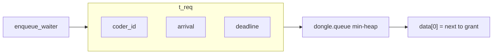

### Deadline formula (`get_deadline`)

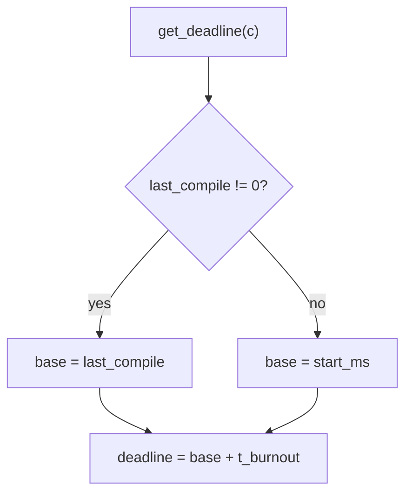

Under EDF, a coder closer to burnout ranks higher in the wait heap.

---

## 2. Where the heap sits in the dongle lifecycle

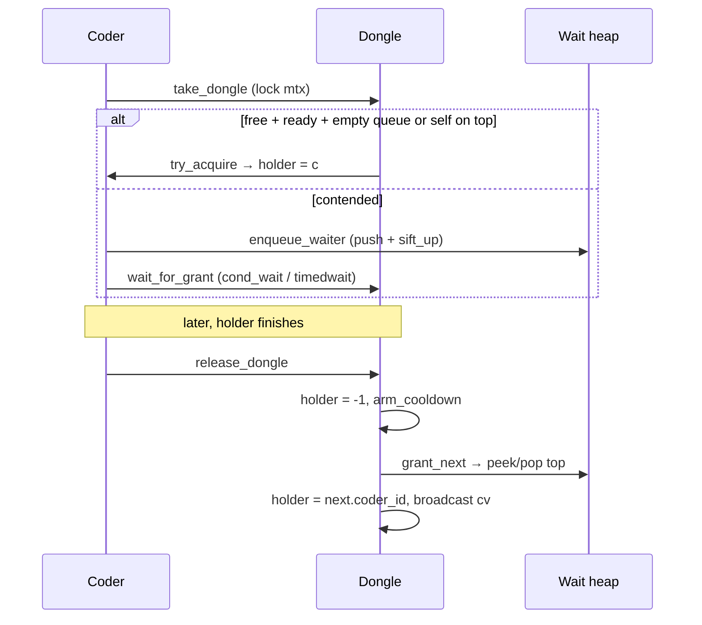

| Function | File | Role for the queue |
|----------|------|--------------------|
| `heap_init` | `heap.c` | Alloc array; store `sched` (`CX_FIFO` / `CX_EDF`) |
| `enqueue_waiter` | `dongle_take.c` | Build `t_req`, `heap_push` |
| `try_acquire` | `dongle_take.c` | If queue nonempty, only top waiter may take |
| `grant_next` | `dongle_release.c` | Pop best request and set `holder` |
| `req_better` | `heap_sift.c` | Compare two requests under current policy |
| `heap_sift_up` / `heap_sift_down` | `heap_sift.c` | Restore heap order after push/pop |

---

## 3. Comparison rule (`req_better`)

`req_better(h, a, b)` is true when **`a` should be closer to the root than `b`**.

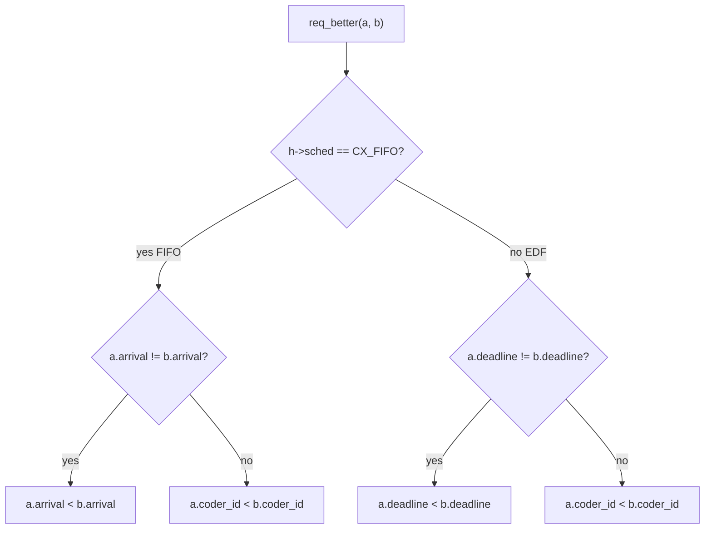

| Policy | Primary key | Tie-break |
|--------|-------------|-----------|
| **FIFO** | smaller `arrival` wins | smaller `coder_id` |
| **EDF** | smaller `deadline` wins | smaller `coder_id` |

---

## 4. FIFO — first come, first served

FIFO ignores deadlines for ordering. Whoever **queued first** becomes next holder (after cooldown).

### Example

| Coder | arrival (ms) | deadline (stored, unused for order) |
|-------|--------------|-------------------------------------|
| 3 | 100 | 900 |
| 1 | 120 | 500 |
| 2 | 110 | 400 |

Order (best → worst): **3 → 2 → 1** (arrival 100 < 110 < 120).

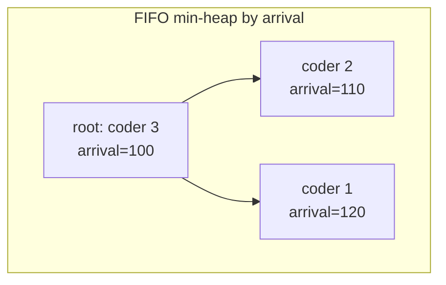

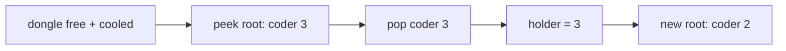

Even if coder 1 is closer to burnout, FIFO still serves coder 3 first because they arrived earlier.

---

## 5. EDF — earliest deadline first

EDF ignores arrival for ordering. Whoever has the **soonest burnout deadline** is next.

### Same waiters, different order

| Coder | arrival | deadline |
|-------|---------|----------|
| 3 | 100 | 900 |
| 1 | 120 | 500 |
| 2 | 110 | 400 |

Order: **2 → 1 → 3** (deadlines 400 < 500 < 900).

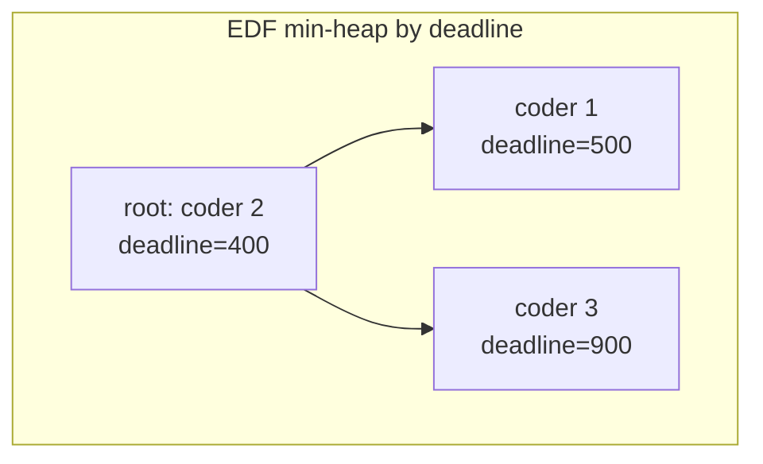

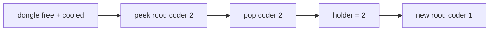

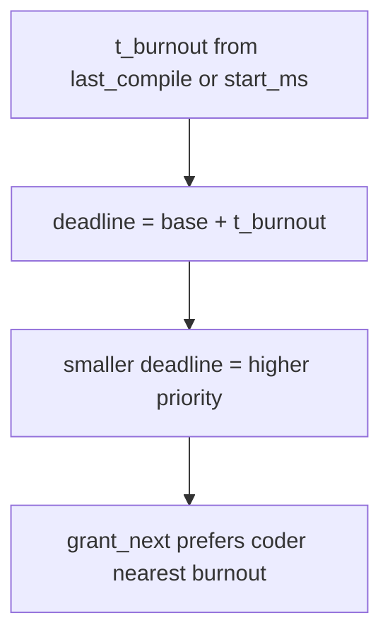

Coder 2 skips ahead of earlier arriver coder 3 — that is the point of EDF vs FIFO.

---

## 6. Side-by-side

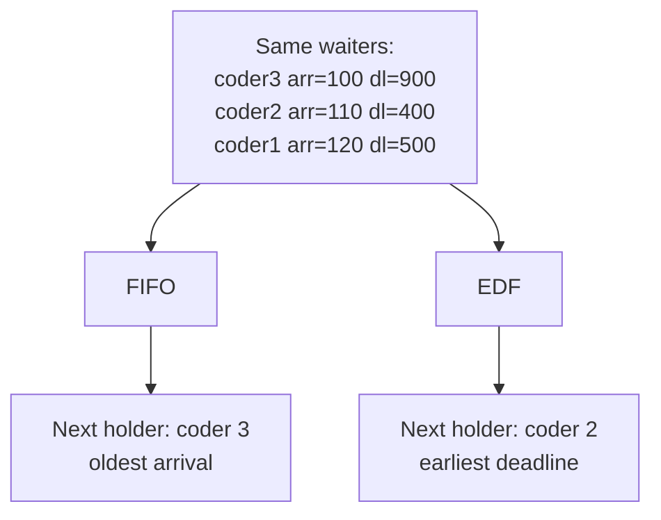

| | FIFO | EDF |
|--|------|-----|
| Goal | Fairness by wait time | Prefer urgency / avoid burnout |
| Primary sort | `arrival` ↑ | `deadline` ↑ |
| Same timestamps | lower `coder_id` | lower `coder_id` |
| Who benefits | Early requesters | Coders closest to `t_burnout` |

---

## 7. Heap operations (same mechanics, different compare)

### Push (enqueue)

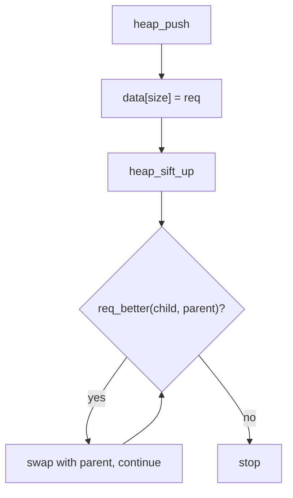

### Pop (grant / dequeue)

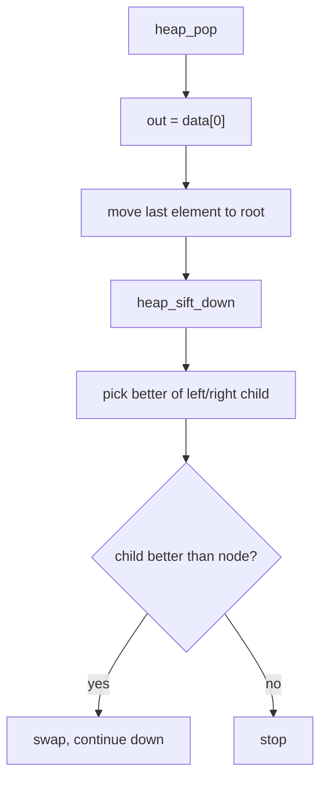

`heap_init(..., cap = n_coders, sched)` sizes the array for at most one waiter per coder per dongle on the normal path.

---

## 8. Fairness gate: empty queue vs top-of-heap

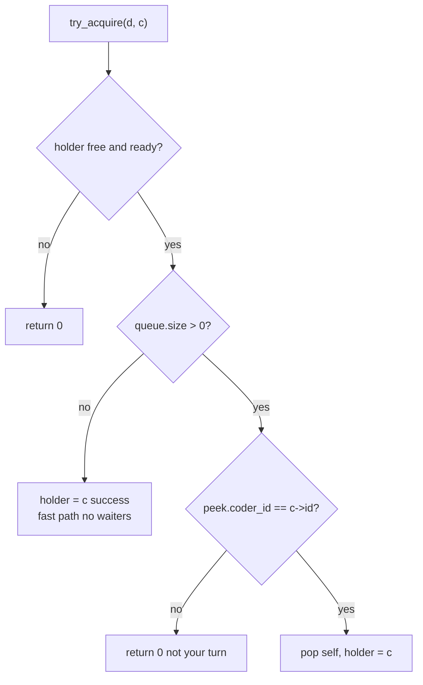

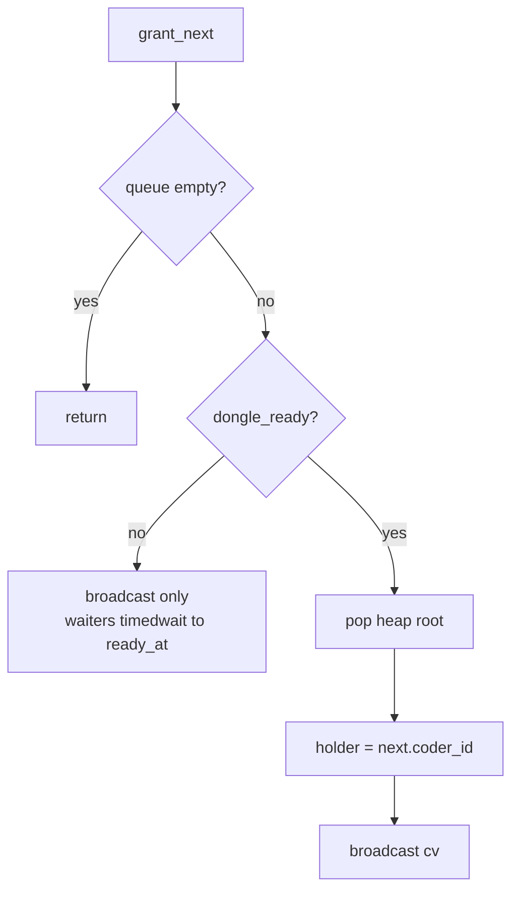

1. **No waiters** → first free coder who hits `try_acquire` takes it.
2. **Waiters present** → only the current root (FIFO- or EDF-best) may become holder.

---

## 9. Functions map

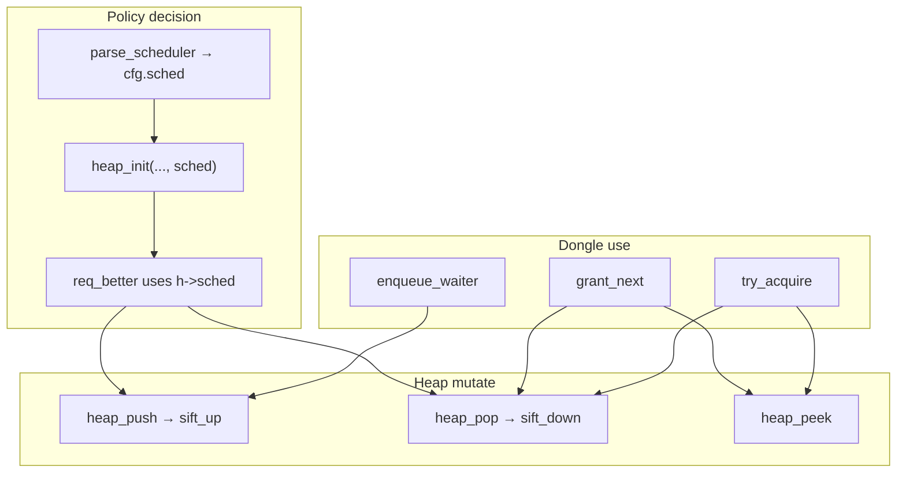

---

## 10. Summary

- Every dongle has a **min-heap** of waiting `t_req` records.
- **FIFO**: who asked first → sort by `arrival`, then `coder_id`.
- **EDF**: who burns out soonest → sort by `deadline` (`last_compile|start_ms + t_burnout`), then `coder_id`.
- On release, after cooling down, `grant_next` gives the dongle to the current heap root under the policy chosen at startup.

Pair with [Workflow.md](Workflow.md) for the full sim lifecycle; this file focuses only on dongle queue priority.
