# Codexion Workflow

End-to-end flow of the simulation: parse config → initialize world (dongles + coders) → spawn threads → run compile cycles → stop → cleanup.

CLI:

```text
./codexion n_coders t_burnout t_compile t_debug t_refactor n_compiles dongle_cd sched
# sched = fifo | edf
```

---

## 1. Top-level pipeline

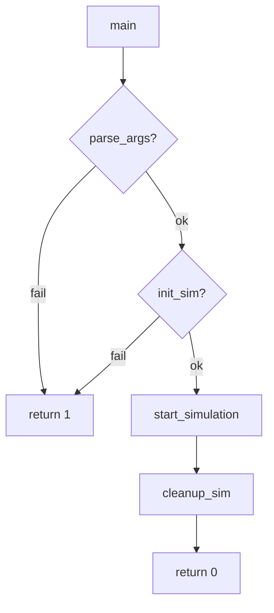

| Step | Function | File | Role |
|------|----------|------|------|
| Entry | `main` | `srcs/main.c` | Orchestrates the whole run |
| Parse | `parse_args` → `fill_config` / `parse_scheduler` | `srcs/parse_args.c` | Fill `t_config` from CLI |
| Init | `init_sim` | `srcs/init_sim.c` | Build shared world (arrays, mutexes, dongles, coders) |
| Run | `start_simulation` | `srcs/sim_run.c` | Stamp clock, spawn monitor + coders, join |
| Teardown | `cleanup_sim` | `srcs/cleanup.c` | Destroy sync objects and free memory |

### If conditions in `main`

| Condition | Role |
|-----------|------|
| `if (parse_args(...))` | Bad argc/values → exit before any allocation |
| `if (init_sim(...))` | Alloc or pthread init failure → exit (init already called `cleanup_sim`) |

---

## 2. Initialization (`init_sim`)

Structures and sync primitives are created here. **No threads yet.**

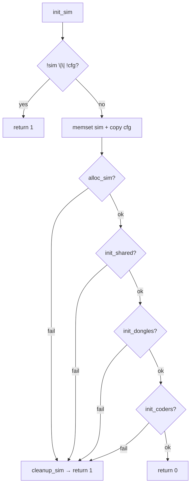

| Function | Role |
|----------|------|
| `alloc_sim` | `malloc` `coders[]` and `dongles[]`, zero them |
| `init_shared` | Init `stop_mtx` + `log_mtx`; `stopped = 0`; set `start_ms = 1` as “shared inited” marker |
| `init_dongles` | For each dongle: wait heap, mutex, condition variable |
| `init_coders` | Reset coder fields and link left/right dongles in a circle |

### If conditions during init

| Location | Condition | Role |
|----------|-----------|------|
| `init_sim` | `!sim \|\| !cfg` | Null guard |
| `init_sim` | any of alloc/shared/dongles/coders fails | Partial teardown via `cleanup_sim` |
| `alloc_sim` | `!sim->coders` / `!sim->dongles` | Out-of-memory; free what was allocated |
| `init_shared` | `pthread_mutex_init(&stop_mtx)` fails | Abort before log mtx exists |
| `init_shared` | `pthread_mutex_init(&log_mtx)` fails | Destroy stop mtx and abort |
| `init_one_dongle` | `heap_init` / mtx / cond fail | Destroy only what this dongle already created |
| `init_dongles` | `init_one_dongle` fails | `rollback_dongles(i - 1)` for prior successes |
| `cleanup_sim` | `if (sim->start_ms)` | Only destroy shared mutexes if `init_shared` ran |

---

## 3. Initializing coders

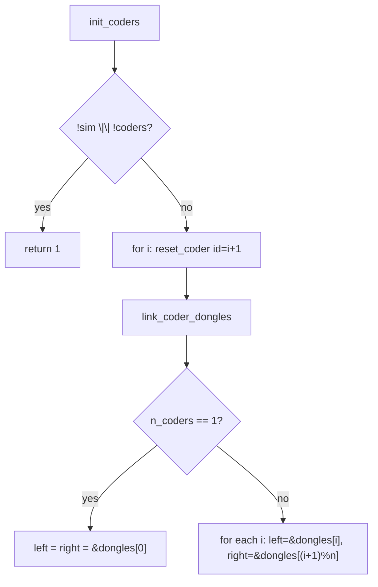

| Function | Role |
|----------|------|
| `reset_coder` | Set `id`, zero `n_compiled` / `last_compile`, clear dongle ptrs, store `sim*` |
| `link_coder_dongles` | Wire dining-circle topology over USB dongles |
| `init_coders` | Reset every coder, then link |

### Dongle topology

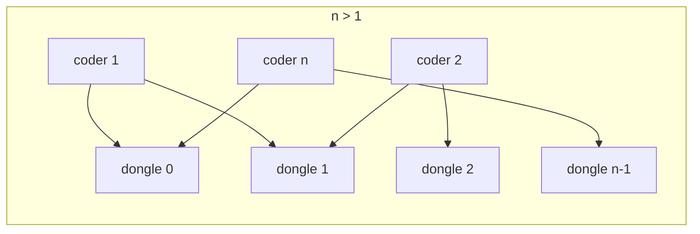

### If conditions in coder init

| Condition | Role |
|-----------|------|
| `reset_coder`: `!c \|\| !sim` | Skip invalid pointer |
| `link_coder_dongles`: `!sim \|\| !coders \|\| !dongles` | Skip if world incomplete |
| `if (n == 1)` | Single-coder special case: both hands hold the **same** dongle (avoids taking twice / deadlock on one resource) |
| `else` multi path | Adjacent pair `(i, (i+1) % n)` — classic circular contention |
| `init_coders`: `!sim \|\| !coders` | Fail init if allocate never ran |

---

## 4. Starting the simulation (threads)

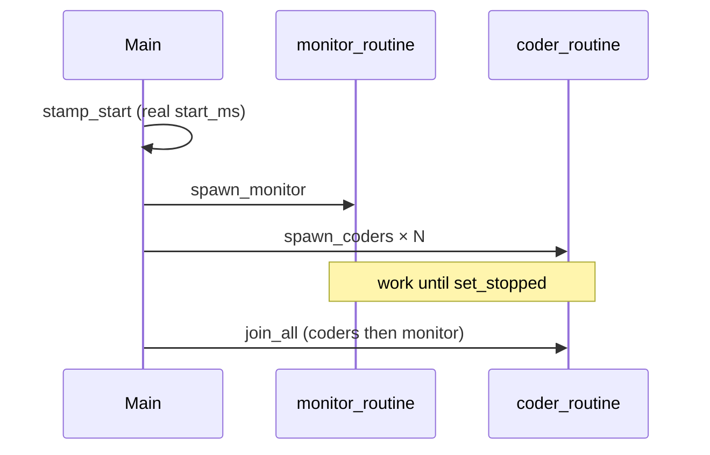

| Function | Role |
|----------|------|
| `stamp_start` | Replace marker `start_ms=1` with wall-clock epoch (burnout / EDF base) |
| `spawn_monitor` | `pthread_create(..., monitor_routine, sim)` |
| `spawn_coders` | One thread per coder → `coder_routine` |
| `join_all` | Join all coder threads, then the monitor |
| `set_stopped` | Set global stop flag and broadcast every dongle CV so waiters wake |

### If conditions at spawn

| Condition | Role |
|-----------|------|
| `spawn_monitor`: create fails | Abort start; caller sets stopped |
| `spawn_coders`: create fails mid-loop | `set_stopped` so already-running peers exit; return error |
| `start_simulation`: `spawn_monitor \|\| spawn_coders` | Ensure stop flag + non-zero return; `main` still calls `cleanup_sim` |

---

## 5. Coder thread lifecycle

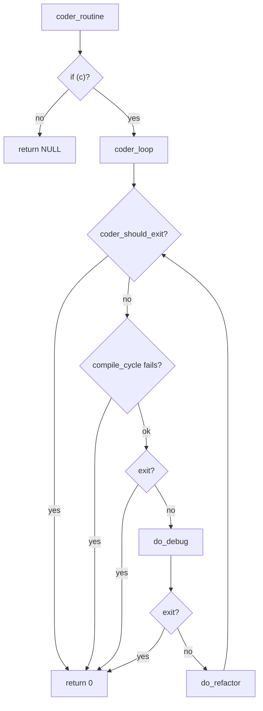

| Function | Role |
|----------|------|
| `coder_routine` | pthread entry; casts arg and runs loop |
| `coder_should_exit` | True if null coder/sim or `is_stopped` |
| `coder_loop` | Repeat: compile → debug → refactor until stop |
| `compile_cycle` | Take dongles → compile → release → bump count |
| `do_debug` / `do_refactor` | Log state and sleep for configured duration (`act_sleep`) |

### If conditions in the coder loop

| Condition | Role |
|-----------|------|
| `coder_should_exit`: `!c \|\| !c->sim` | Treat bad arg as “exit” (safe default) |
| `while (!coder_should_exit)` | Cooperative halt driven by monitor / spawn failure |
| `if (compile_cycle(c)) break` | Stop/take failure ends the loop (no stuck phases) |
| Exit checks before debug / after debug | Do not start the next phase after a stop was signaled |
| `coder_routine`: `if (c)` | Ignore null pthread arg |
| `do_debug` / `do_refactor`: stopped or null | Skip logging/sleep when shutting down |

---

## 6. Compile cycle and dongle ordering

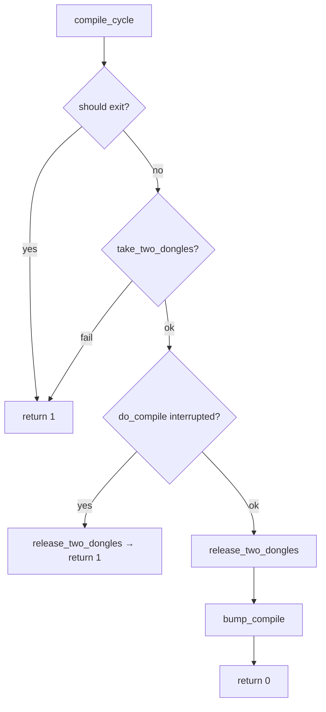

### Taking two dongles (deadlock avoidance)

Always acquire the **lower dongle id first** via `dongle_first`. If the second take fails, release the first.

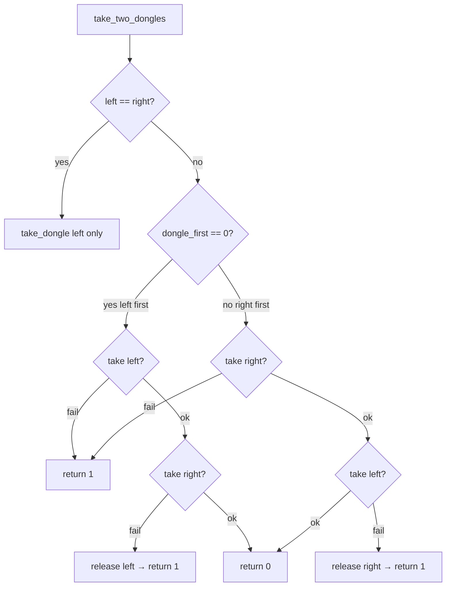

Release uses the **inverse** order of acquire (higher id released first when left was first).

| Function | Role |
|----------|------|
| `dongle_first` | `0` if `left->id <= right->id` (take left first), else `1` |
| `take_two_dongles` | Acquire one or two dongles with rollback on partial failure |
| `release_two_dongles` | Symmetric release / single-dongle shortcut |
| `do_compile` | Stamp `last_compile`, log `ST_COMPILE`, sleep `t_compile` |
| `bump_compile` | Increment `n_compiled` after a successful full cycle |

### If conditions in compile / ordering

| Condition | Role |
|-----------|------|
| `compile_cycle`: already exiting | Skip work |
| `take` fails | Abort without compiling |
| `do_compile` fails (interrupt/stop) | **Must** release held dongles before returning |
| `left == right` (take/release) | N=1 path: one take, one release |
| `dongle_first == 0` vs else | Canonical lock ordering → no circular wait between neighbors |
| Second take fails | Release first dongle so it isn’t held forever |
| `dongle_first`: null pointers | Default to `0` (safe/conservative) |
| `do_compile`: stopped | Refuse to start a compile past halt |

---

## 7. Single-dongle protocol (`take_dongle` / `release_dongle`)

Sync: per-dongle `mtx` + `cv` + wait heap (FIFO or EDF).

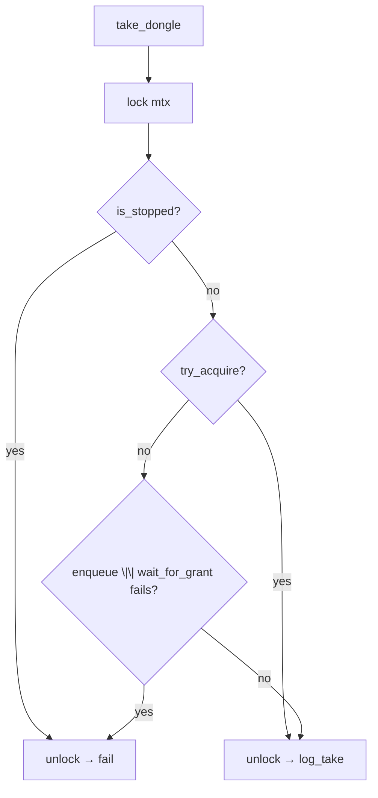

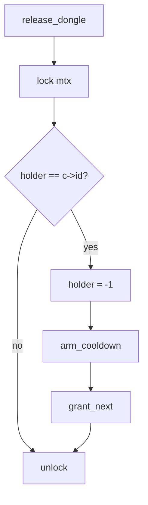

| Function | Role |
|----------|------|
| `dongle_ready` | True when `now >= ready_at` (cooldown elapsed) |
| `try_acquire` | Instant grant if free, cooled down, and queue empty-or-self-on-top |
| `enqueue_waiter` | Push `{coder_id, arrival, deadline}` onto heap |
| `wait_for_grant` | Cond wait / timedwait until holder or stop |
| `arm_cooldown` | Set `ready_at = now + dongle_cd` |
| `grant_next` | Pop best waiter and set `holder`, or just broadcast if still cooling |
| `signal_waiter` | `pthread_cond_broadcast` on the dongle |
| `req_better` | Heap priority: FIFO by arrival, or EDF by deadline; ties by lower `coder_id` |

### If conditions in take / release / heap

| Condition | Role |
|-----------|------|
| `take_dongle`: null args | Fail fast |
| Locked + `is_stopped` | Don’t acquire during shutdown |
| `!try_acquire` | Contended: enqueue then wait |
| `enqueue \|\| wait` fails | Unlock and return error (stop or heap/wait fail) |
| `try_acquire`: held / not ready | Cannot steal a busy or cooling dongle |
| Queue nonempty and top ≠ self | Fairness: only the scheduled next waiter may take |
| Queue nonempty and top == self | Pop self and become holder |
| `wait_for_grant` loop: while not stopped and not holder | Stay until granted or halt |
| `try_acquire` inside wait loop | Win race if free after a spurious wake |
| Not ready and `ready_at > 0` → timedwait | Wake exactly when cooldown ends |
| Else → `cond_wait` | Wait for grant/broadcast |
| Return `holder != c->id` | Fail if left the loop without ownership (typically stop) |
| `release`: `holder == c->id` | Only the owner may clear, arm cooldown, and grant |
| `grant_next`: empty queue | Nothing to schedule |
| Not ready yet | Broadcast so waiters switch to timedwait |
| `req_better` FIFO vs EDF | Selects who sits at the top of the wait heap |
| Arrival/deadline ties | Lower `coder_id` wins for determinism |

---

## 8. Monitor thread

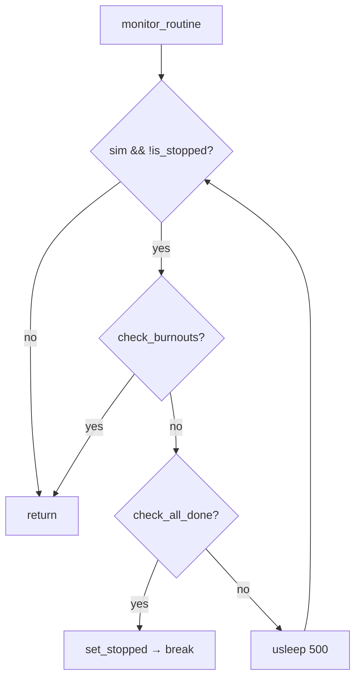

| Function | Role |
|----------|------|
| `check_burnouts` | Any coder with no compile start within `t_burnout` of last compile (or `start_ms`) → stop + log burnout |
| `check_all_done` | Every coder has `n_compiled >= n_compiles` |
| `monitor_routine` | Poll ~every 500µs until a terminal condition |

### If conditions in the monitor

| Condition | Role |
|-----------|------|
| Loop: `sim && !is_stopped` | Exit if null or already stopped |
| `n_compiled < n_compiles` | Not everyone finished → keep running |
| `!last_compile` → use `start_ms` | Burnout clock starts at sim epoch until first compile |
| `now - base >= t_burnout` | Terminal failure: coder starved of compiles |
| `check_all_done` true | Success path: set stop so coder loops unwind |

---

## 9. Stop signal and logging

| Function | Role |
|----------|------|
| `is_stopped` | Read `stopped` under `stop_mtx` |
| `set_stopped` | Write `stopped=1`, broadcast **all** dongle CVs |
| `log_msg` | Serialize prints under `log_mtx` |
| `act_sleep` | Interruptible sleep; returns early if stop is set |

### If conditions

| Condition | Role |
|-----------|------|
| `log_msg`: `!is_stopped \|\| st == ST_BURNOUT` | Suppress post-stop noise, but always print the burnout line |
| `get_deadline`: `!last_compile` → `start_ms` | EDF deadline anchored like burnout base |
| `destroy_dongles`: `if (d->sim)` | Only destroy dongles that finished `init_one_dongle` (`sim` pointer set last) |

---

## 10. Cleanup

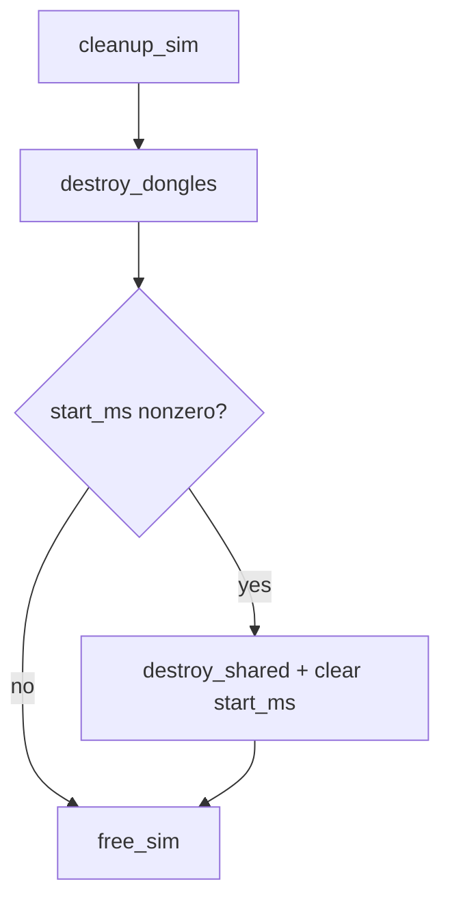

| Function | Role |
|----------|------|
| `destroy_dongles` | Per dongle: `heap_destroy`, mutex/cond destroy |
| `destroy_shared` | Destroy `stop_mtx` and `log_mtx` |
| `free_sim` | Free coder and dongle arrays |

---

## 11. Full call graph (from coder init onward)

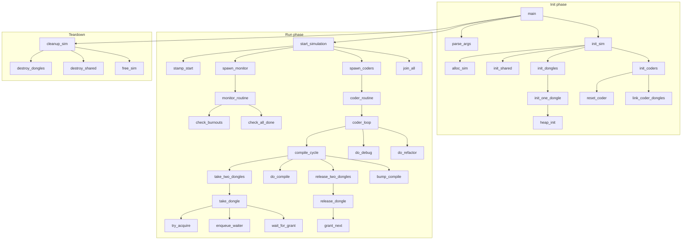

---

## 12. Shared state (no IPC)

Everything is in-process pthread sharing of `t_sim`:

| Object | Purpose |
|--------|---------|
| `stop_mtx` + `stopped` | Global cooperative halt |
| `log_mtx` | Serialize stdout |
| Per-dongle `mtx` / `cv` / wait heap | Ownership, cooldown, FIFO/EDF queuing |
| `coder.left` / `coder.right` | Which dongles a coder must hold to compile |

Coders write `n_compiled` / `last_compile`; the monitor reads them while polling. Stop is always taken under `stop_mtx`.
