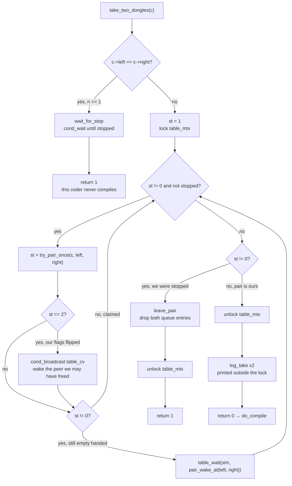
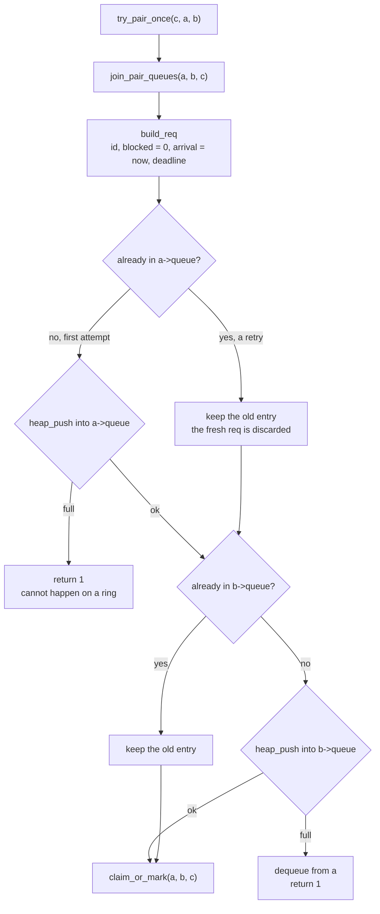
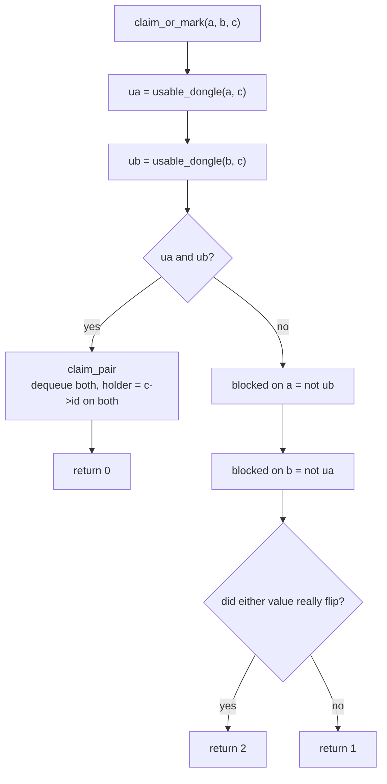
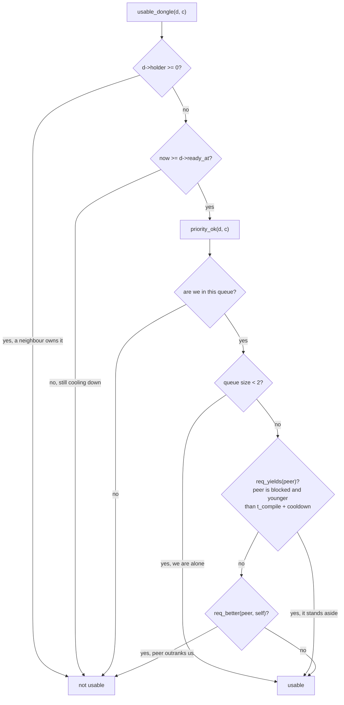
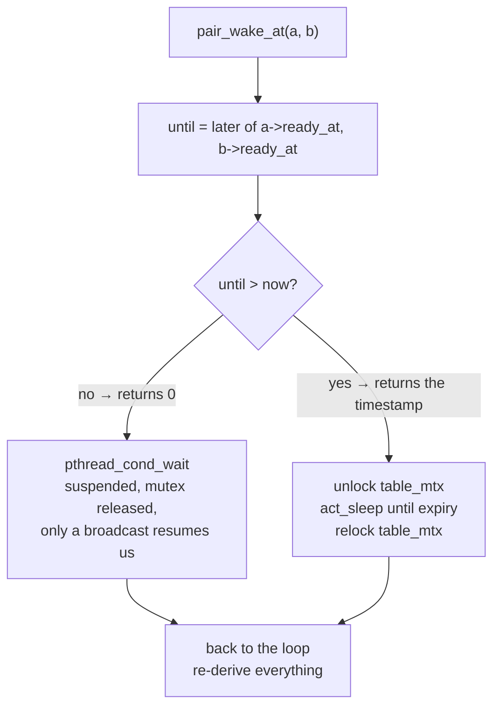
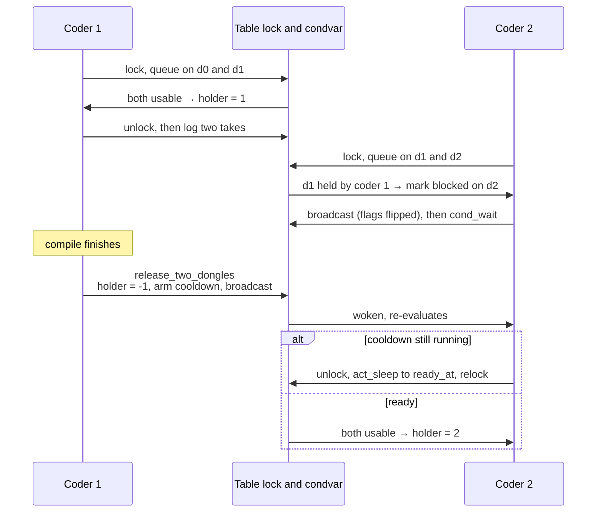

# `take_two_dongles`

Acquires **both** of a coder's dongles or none of them, then returns. It is the
only place a coder blocks waiting for a dongle, and the only place a `holder` is
assigned to a coder. On entry the coder holds no lock; on every path it leaves
holding none.

Files: `srcs/coder_take.c`, `srcs/dongle_wait.c`, `srcs/dongle_take.c`,
`srcs/dongle_pair.c`.

---

## 1. Full control flow

Two details the diagram encodes on purpose:

- `st == 1` sends **no** broadcast. A retry that changed nothing must not wake
  anyone, otherwise two neighbours wake each other forever.
- the two log lines happen **after** the unlock. Lock order is
  `log_mtx -> table_mtx`, so logging while holding the table lock would invert it.

---

## 2. `try_pair_once` — register, then try to claim

`ensure_queued` returning early on a retry is what makes a waiter keep its
place: `arrival` and `blocked` from the first attempt survive every later pass,
so FIFO and EDF order stay stable while the coder waits.

---

## 3. `claim_or_mark` — the three outcomes

`claim_pair` writes both `holder` fields inside one critical section, so no
thread can ever observe a half-taken pair. A `blocked` flag means *my other
dongle is unusable*, which is the signal that lets a peer overtake us.

---

## 4. `usable_dongle` — why a dongle is refused

`req_better` is FIFO by `arrival` or EDF by `deadline`, ties broken by the lower
`coder_id`. The staleness bound in `req_yields` is what stops a bypassed waiter
from being skipped forever.

---

## 5. `table_wait` — how the coder sleeps

A cooldown is a time event nobody can signal, so it is waited out unlocked. No
opportunity is lost by doing so: until that instant the coder still needs a
dongle that is not ready, so nothing arriving earlier could have helped it.
Spurious wakeups are harmless because the loop re-reads all state rather than
inferring anything from having been woken.

---

## 6. Two neighbours contending

---

## 7. Return value

| Value | Meaning | State on return |
|-------|---------|-----------------|
| `0` | pair claimed | `holder == c->id` on both dongles, two takes logged, no lock held |
| `1` | gave up because the simulation stopped, or `n == 1` | no dongle held, queue entries removed, no lock held |

`compile_cycle` treats `1` as "stop now" and ends the coder's loop; on `0` it
proceeds to `do_compile` and later to `release_two_dongles`.
