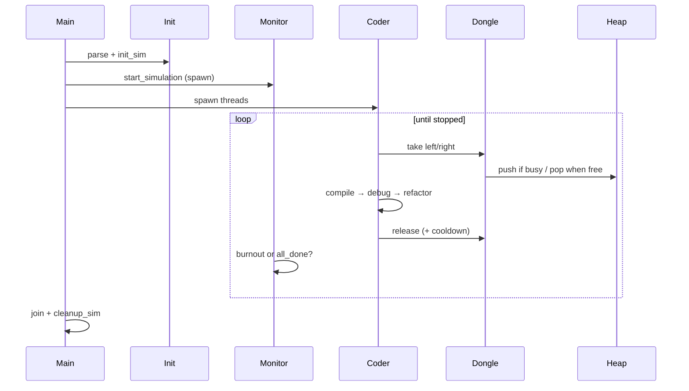

# Codexion — Workflow (short)

## Big picture

Coders sit in a circle and share USB dongles. To **compile** they need two dongles (one if alone). Between compiles they **debug** then **refactor**. If someone goes too long without starting a compile → **burnout**. Dongles may sit on **cooldown** after release. Who waits next is decided by a **heap**: `fifo` or `edf`.

---

## Program order (`main`)

1. **`parse_args`** — read CLI into `t_config` (reject bad input)
2. **`init_sim`** — allocate world, mutexes, dongles (+ heap each), link coders
3. **`start_simulation`** — stamp time, spawn monitor + coder threads, join
4. **`cleanup_sim`** — destroy heaps/mutexes/conds, free memory

---

## One compile cycle (per coder thread)

1. Take left & right dongle (lower id first → avoid deadlock)
2. Log `has taken a dongle` (×2, or ×1 if single coder)
3. Stamp `last_compile`, log `is compiling`, sleep `time_to_compile`
4. Release both → each dongle starts cooldown → heap grants next waiter
5. Log `is debugging` → sleep
6. Log `is refactoring` → sleep
7. Repeat until simulation stopped

---

## Who gets a busy dongle? (heap)

Each dongle has a wait **heap**:

- waiter **`push`**es `{coder_id, arrival, deadline}`
- on free + cooldown done → **`pop`** best request
- **FIFO:** oldest `arrival` (tie → lower id)
- **EDF:** earliest `deadline` = last compile start (or sim start) + `time_to_burnout` (tie → lower id)

---

## How the sim stops (monitor thread)

Every ~0.5ms the monitor checks:

- **Burnout:** `now - base >= time_to_burnout` → log `burned out`, set stop
- **Success:** every coder has `n_compiled >= number_of_compiles_required` → set stop

Stop wakes anyone waiting on a dongle condvar; threads exit; `main` cleans up.

---

## Sequence (happy path)

---

## Files vs role

| Step | Main files |
|------|------------|
| Parse | `parse_args.c`, `parse_number.c` |
| Init / cleanup | `init_*.c`, `cleanup.c` |
| Heap | `heap.c`, `heap_sift.c` |
| Dongles | `dongle_take.c`, `dongle_release.c` |
| Coders | `coder_*.c` |
| Log / monitor / run | `logger.c`, `monitor.c`, `sim_run.c` |
